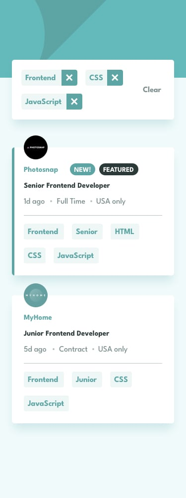

# 💼 Job Listings Filter

A responsive job listings app built with **HTML**, **Tailwind CSS**, and **JavaScript** that allows users to filter job postings based on selected tags (e.g., role, level, languages, tools). Inspired by the [Frontend Mentor challenge](https://www.frontendmentor.io/challenges/job-listings-with-filtering-ivstIPCt).

## 🔗 Live Demo

[Click here to view the live site](https://yusufbolden.github.io/jobListingsFilter/)


## 🔍 Features

- ✅ Dynamic job listings rendered from `data.json`
- ✅ Filter jobs based on selected categories
- ✅ Remove individual filters or clear all
- ✅ Responsive design for desktop and mobile
- ✅ Pure Tailwind CSS styling (no custom CSS)

## 🛠️ Tech Stack

- **HTML** – Semantic structure
- **Tailwind CSS** – Utility-first styling
- **JavaScript** – DOM manipulation and filtering logic
- **JSON** – Job listings data

## 📁 Project Structure

```
jobListingsFilter/
├── index.html
├── style.css (optional - unused in final version)
├── app.js
├── data.json
├── README.md
└── assets/
└── images/ (company logos and icons)
```

## 🚀 Getting Started

To run the project locally:

1. **Clone the repository:**

   ```bash
   git clone https://github.com/YusufBolden/jobListingsFilter.git
   cd jobListingsFilter

   ```

2. Open index.html in your browser:

```
open index.html
```
No build steps or server required – this project runs fully client-side.

## 🔧 Approach & Challenges

### My Approach

This project was built to closely follow the design and interactivity requirements from the [Frontend Mentor Job Listings Filter challenge](https://www.frontendmentor.io/challenges/job-listings-with-filtering-ivstIPCt). The goals were:

- Match the design **pixel-perfectly** using only **Tailwind CSS** (no custom CSS)
- Implement a clean, responsive layout for both desktop and mobile
- Allow users to filter job listings based on role, level, tools, and languages

The filtering logic is entirely client-side, written in vanilla JavaScript. Tags are dynamically generated, and active filters update the job listings in real time.

### Customizations

- Replaced traditional CSS with **Tailwind CSS utilities** for maintainability and speed
- Used semantic HTML to ensure good accessibility practices
- Added transition effects to tags and buttons for smoother interactivity
- Ensured **mobile-first responsiveness** using Tailwind’s responsive classes
- Load job listings dynamically from a `data.json` file

### Challenges & Solutions

#### 🧠 Filter Logic
It was tricky to get the filtering mechanism to behave correctly when multiple tags were selected. I addressed this by:
- Storing active filters in an array
- Filtering listings by checking that *every* active tag is included in a job's attributes

#### 📱 Responsive Design
Making the filter bar scrollable on mobile while keeping the design clean required experimenting with `overflow-x-auto` and `flex-wrap`.

#### 🖼 Image Path Issues
Some logos weren’t displaying correctly at first due to relative path issues. This was fixed by double-checking the file structure and ensuring all asset references matched the deployed directory structure.

---

The result is a clean, responsive, and fully interactive job listings app that adheres closely to the original challenge specifications while being optimized with Tailwind and JavaScript.

## 📸 Screenshots

### Desktop


### Mobile




### Active-States


🤝 Acknowledgements
Design by Frontend Mentor

📄 License
This project is open-source and available under the MIT License.
